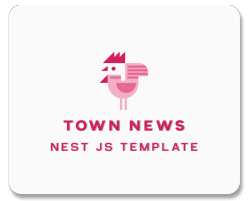

> nest js 模板終於上線啦!

<!-- truncate -->

## 模板內容

1. swagger
2. dockerfile

## 使用方式

### 下載

[載點](https://github.com/Chicken-Town-Nest-Workshop/nest-template)

- code > download Zip
- 解壓縮

### 使用方式

- 修改專案名稱
- 於 `package.js` 修改 `name`

```js {2}
{
  "name": "[專案名稱]",
  "version": "0.0.1",
  "description": "",
  "author": "",
  "private": true,
  "license": "UNLICENSED",
  "scripts": {
    "build": "nest build",
-- 下略 --
```

- 安裝依賴

```shell
pnpm i
```

- 啟動

```shell
pnpm start
```

> 開啟: <http://localhost:3055/api>

## docker

### 建立 image

```shell
docker build --pull --rm -f ".dockerfile" -t [image name]:[version] . 
```

### run image

```shell
docker run --name nest-app -p 3055:3055 [image name]:[version]
```

> 開啟: <http://localhost:3055/api>

## 小雞鎮在這邊祝福大家有美好的一天
