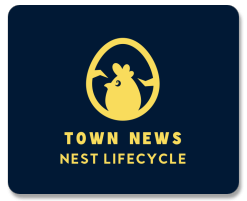
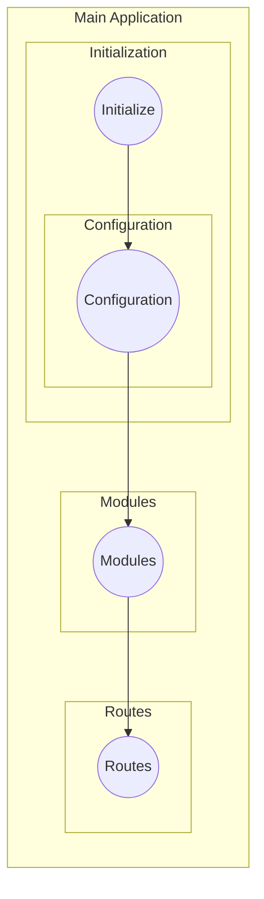
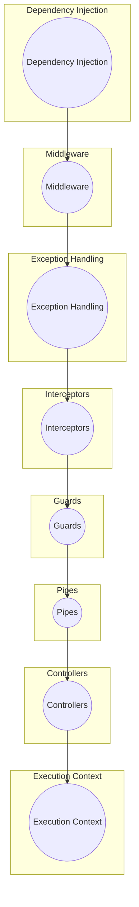

> 小雞鎮今天更新了 Nest 的生命週期圖哦!

<!-- truncate -->

## Nest js 生命週期

### 主程式生命週期

```mermaid
graph LR
  subgraph Main Application
    subgraph Initialization
      nest-init((Initialize))
      subgraph Configuration
        nest-config((Configuration))
      end
    end
    subgraph Modules
      nest-modules((Modules))
    end
    subgraph Routes
      nest-routes((Routes))
    end
  end
  
  nest-init --> nest-config
  nest-config --> nest-modules
  nest-modules --> nest-routes
```

### Runtime 生命週期

```mermaid
graph TB

subgraph Dependency Injection
    nest-di((Dependency Injection))
end

subgraph Middleware
    nest-middleware((Middleware))
end

subgraph Exception Handling
    nest-exception((Exception Handling))
end

subgraph Interceptors
    nest-interceptor((Interceptors))
end

subgraph Guards
    nest-guard((Guards))
end

subgraph Pipes
    nest-pipe((Pipes))
end

subgraph Controllers
    nest-controller((Controllers))
end

subgraph Execution Context
    nest-context((Execution Context))
end

nest-di --> nest-middleware
nest-middleware --> nest-exception
nest-exception --> nest-interceptor
nest-interceptor --> nest-guard
nest-guard --> nest-pipe
nest-pipe --> nest-controller
nest-controller --> nest-context
```

[前往觀看文章...](https://town.lychicken.com/docs/nest/about)

## 小雞鎮祝大家有個美好的一周
