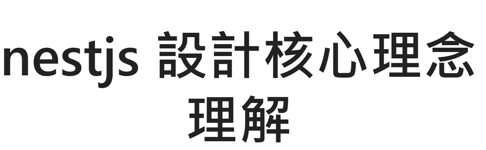

> 就在今晚 10:00 快來聽副鎮長的演唱會

<!-- truncate -->

## 簡報

[前往觀看完整簡報...](https://hackmd.io/@JgGTFI_BRjyUv6YuG1bmUQ/B1M_-IHeT#/)

## 範例 GitHub

> This is nestjs request sample for test request lifecycle

[前往觀看完整程式碼...](https://github.com/nodejs-typescript-classroom/nestjs-request-response)

## 小雞鎮趕快來聽副鎮長的演唱會
