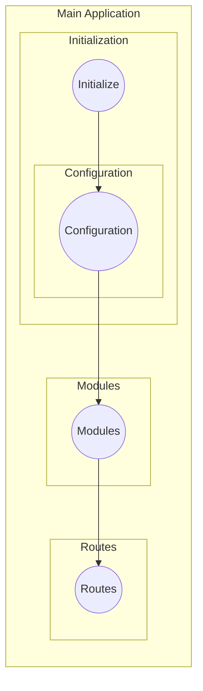
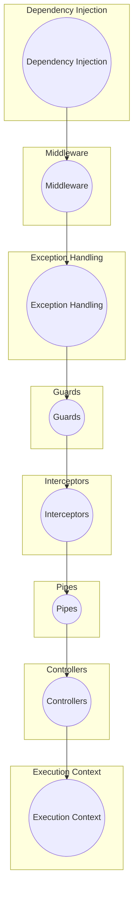

# 🐔 關於 NestJS

## 語言

> 在 NestJS 框架底下，我們將使用 TypeScript 來做為主要編寫的語言

## 環境

- 安裝 Node (>= 16) [nvm 安裝](https://blog.lychicken.com/docs/daylilyTool/toolNode/setNvm)
- NestJS CLI

```shell
# 安裝 CLI
npm i -g @nestjs/cli
```

## 建立專案

### 建立

```shell
# 建立專案
nest new [project-name]
```

### 使用 TypeScript 功能

```shell
# 建立專案
nest new [project-name] --strict
```

### 建立公用 lib

```shell
# 建立專案
cd [project-name]; nest g lib ${library-name} 
```

## 專案架構

### 目錄結構

```text
src
└─app.controller.spec.ts
│
└─app.controller.ts
│
└─app.module.ts
│
└─app.service.ts
│
└─main.ts
```

### 檔案說明

| 檔案               | 描述                                                     |
|----------------------|----------------------------------------------------------|
| app.controller.ts    | 具有單一路由的基本控制器                                |
| app.controller.spec.ts | 控制器的單元測試                                    |
| app.module.ts        | 應用程式的根模組                                       |
| app.service.ts       | 具有單一方法的基本服務                                  |
| main.ts              | 應用程式的入口檔案，使用核心函數 NestFactory 創建一個 Nest 應用程式實例 |

### main.ts

```js
import { NestFactory } from '@nestjs/core';
import { AppModule } from './app.module';

async function bootstrap() {
  const app = await NestFactory.create(AppModule);
  await app.listen(3000);
}
bootstrap();
```

> 可切換底層框架為 `express` 或 `fastify`

- 切換為 express

```js {5}
import { NestFactory } from '@nestjs/core';
import { AppModule } from './app.module';

async function bootstrap() {
  const app = await NestFactory.create<NestExpressApplication>(AppModule);
  await app.listen(3000);
}
bootstrap();
```

- 切換為 fastify

```js {5}
import { NestFactory } from '@nestjs/core';
import { AppModule } from './app.module';

async function bootstrap() {
  const app = await NestFactory.create<NestFastifyApplication>(AppModule);
  await app.listen(3000);
}
bootstrap();
```

## Nest js 生命週期

### 主程式生命週期



### Runtime 生命週期



---

## REF

[NestJS 官網](https://docs.nestjs.com/first-steps)

[梁大哥 教學](https://hackmd.io/@JgGTFI_BRjyUv6YuG1bmUQ/B1ZKISX_n/%2FJ0qGnxwLSW-f8ZsGvGjAag)
